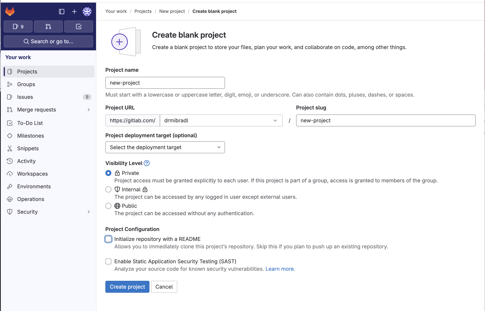

# Chapter3
This module we learned about the Remote Git Repository.

# Name: Remote Git Repository - Remote and Local

# Description: 

Remote Repository

Different Git Repositories available: GitHub, GitLab, Bitbucket
Platforms that host your repository
Companies have own Git servers
Private vs. public repositories
Public repositories for open source projects
You can do a lot via the platorms UI

Local Repository

Git client needs to be installed - UI Client
www.git-scm.com/downloads/guis

Git Command Line Tool
www.git-scm.com/downloads

For convenience customize the terminal

Add code to ~/.zshrc

parse_git_branch() {
git branch 2> /dev/null | sed -n -e 's/^\* \(.*\)/[\1]/p'
}
COLOR_DEF='%f'
COLOR_USR='%F{243}'
COLOR_DIR='%F{197}'
COLOR_GIT='%F{39}'
NEWLINE=$'\n'
setopt PROMPT_SUBST
export PROMPT='${COLOR_USR}%n@%M ${COLOR_DIR}%d ${COLOR_GIT}$(parse_git_branch)${COLOR_DEF}${NEWLINE}%% '

Git client needs to be connected with remote platform

% git clone git@gitlab.com:drmibradl/new-project.git
Cloning into 'new-project'...
warning: You appear to have cloned an empty repository.
michaelbradley@Michaels-iMac-2.local /Users/michaelbradley 
% 

You need to authenticate to GitHub/GitLab/..
Your Public SSH Key must be added to the remote platform

GitHub/GitLab can authenticate us when pushing/pulling from repository
This can be done without providing username and password each time

# Usage

https://gitlab.com/drmibradl/new-project

% git clone git@gitlab.com:drmibradl/new-project.git
Cloning into 'new-project'...
warning: You appear to have cloned an empty repository.
michaelbradley@Michaels-iMac-2.local /Users/michaelbradley 
% 

michaelbradley@Michaels-iMac-2.local /Users/michaelbradley 
% ls
Desktop		Downloads	Movies		Pictures	lists.txt	my-demo		new-project	test.sh
Documents	Library		Music		Public		mongo.yaml	my-project	setup.sh
michaelbradley@Michaels-iMac-2.local /Users/michaelbradley 
% 

michaelbradley@Michaels-iMac-2.local /Users/michaelbradley 
% ls
Desktop		Downloads	Movies		Pictures	lists.txt	my-demo		new-project	test.sh
Documents	Library		Music		Public		mongo.yaml	my-project	setup.sh
michaelbradley@Michaels-iMac-2.local /Users/michaelbradley 
% cd new-project 
michaelbradley@Michaels-iMac-2.local /Users/michaelbradley/new-project 
% ls -la
total 0
drwxr-xr-x   3 michaelbradley  staff    96 Jun 12 16:19 .
drwxr-x---+ 32 michaelbradley  staff  1024 Jun 12 16:19 ..
drwxr-xr-x   9 michaelbradley  staff   288 Jun 12 16:19 .git
michaelbradley@Michaels-iMac-2.local /Users/michaelbradley/new-project 
% 

