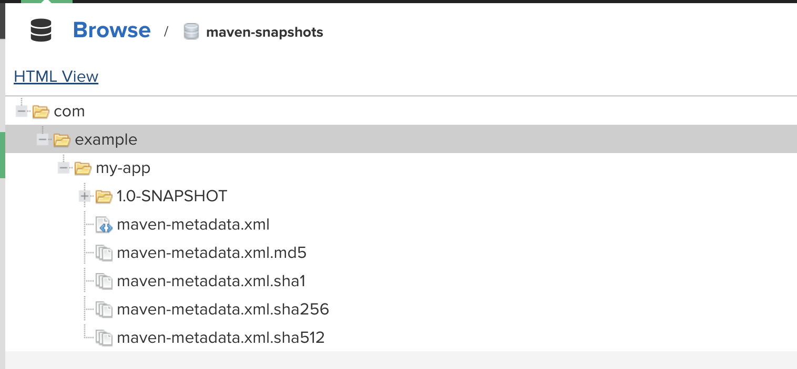

# Chapter6
This module we reviewed how to publish artifact to Nexus Repository

# Name: Publish artifact to Nexus Repository

# Description: 

Goal - Upload Jar File to Nexus

    Upload Jar File to existing hosted repository on Nexus

    Maven/Gradle command for push to remote repository

    Configure both tools to connect to Nexus (Nexus Repo URL + Credentials)

    Nexus User with permission to upload

Create Nexus User

    Server Administration and Configuration

    Security

    Users

    Create local user

        anonymous user

    Create Role

        Role Type: Nexus Role

        From the User tab, select user just created and assign nx-java role (nx-maven-snapshot*)

Gradle Project

build.gradle file

    Configure to copy my-app-1.0-SNAPSHOT.jar to Nexus java-maven-snapshot repo

    publishing {
    publications {
        maven(MavenPublication) {
            artifact("build/libs/my-app-$version"+".jar"){
                extension 'jar'
            }
        }
    }

    repositories {
        maven {
            name 'nexus'
            url "http://157.230.238.59:8081/repository/maven-snapshots/"
            allowInsecureProtocol = true
            credentials {
                username project.repoUser
                password project.repoPassword
            }
        }
    }
}

 settings.gradle file

 pluginManagement {
    repositories {
        maven { url 'https://repo.spring.io/milestone' }
        maven { url 'https://repo.spring.io/snapshot' }
        gradlePluginPortal()
    }
}
rootProject.name = 'my-app'

 gradle.properties file

repoUser = michael
repoPassword = Greater16

Gradle Project

    Jar Upload

    % gradle build
    Starting a Gradle Daemon, 1 incompatible Daemon could not be reused, use --status for details

    Deprecated Gradle features were used in this build, making it incompatible with Gradle 9.0.

    You can use '--warning-mode all' to show the individual deprecation warnings and determine if they come from your own scripts or plugins.

    For more on this, please refer to https://docs.gradle.org/8.8/userguide/command_line_interface.html#sec:command_line_warnings in the Gradle documentation.

    BUILD SUCCESSFUL in 8s

    Generated new artifact *.jar

    [text](../../../../../new-project/java-app/build/libs/my-app-1.0-SNAPSHOT.jar)

    Publish file made available by apply plugin in build.gradle file

    apply plugin: 'maven-publish'

    michaelbradley@Michaels-iMac-2 java-app % gradle publish

    Deprecated Gradle features were used in this build, making it incompatible with Gradle 9.0.

    You can use '--warning-mode all' to show the individual deprecation warnings and determine if they come from your own scripts or plugins.

    For more on this, please refer to https://docs.gradle.org/8.8/userguide/command_line_interface.html#sec:command_line_warnings in the Gradle documentation.

    BUILD SUCCESSFUL in 6s
    2 actionable tasks: 2 executed

    

    Artifact is now visible in Nexus Repository - from the Browse View and maven.snapshots

    
    com
            example                                             GROUP 
                        my-app                                  Name     
                                    1.0-SNAPSHOT                Version

Maven Project

    Configure build to store artifact in Nexus

    Defines the application to push artifact to nexus repo.

    <plugin>
                <groupId>org.apache.maven.plugins</groupId>
                <artifactId>maven-deploy-plugin</artifactId>
                <version>3.1.1</version>
            </plugin>

            <plugin>
                <groupId>org.apache.maven.plugins</groupId>
                <artifactId>maven-deploy-plugin</artifactId>
            </plugin>

    Distribution block identifies maven build to publish to nexus repo named maven-snapshots

    <distributionManagement>
        <snapshotRepository>
            <id>nexus-snapshots</id>
            <url>http://157.230.22.19:8081/repository/maven-snapshots/</url>
        </snapshotRepository>
    </distributionManagement>

    Create ~/.m2/settings.xml file to reference <id>nexus-snapshots</id> block in code

    michaelbradley@Michaels-iMac-2 .m2 % cat settings.xml 

    <settings>
    <servers>
        <server>
        <id>nexus-snapshots</id>
        <username>michael</username>
        <password>Greater16</password>
        </server>
    </servers>
    </settings>

Perform build of maven project and push to nexus maven-snapshot repo

    michaelbradley@Michaels-iMac-2 java-maven-app % mvn package
    [INFO] Scanning for projects...
    [WARNING] 
    [WARNING] Some problems were encountered while building the effective model for com.example:java-maven-app:jar:1.1.0-SNAPSHOT
    [WARNING] 'build.plugins.plugin.(groupId:artifactId)' must be unique but found duplicate declaration of plugin org.apache.maven.plugins:maven-deploy-plugin @ line 21, column 25
    [WARNING] 
    [WARNING] It is highly recommended to fix these problems because they threaten the stability of your build.
    [WARNING] 
    [WARNING] For this reason, future Maven versions might no longer support building such malformed projects.
    [WARNING] 
    [INFO] 
    [INFO] ---------------------< com.example:java-maven-app >---------------------
    [INFO] Building java-maven-app 1.1.0-SNAPSHOT
    [INFO]   from pom.xml
    [INFO] --------------------------------[ jar ]---------------------------------
    [INFO] 
    [INFO] --- resources:3.3.1:resources (default-resources) @ java-maven-app ---
    [WARNING] Using platform encoding (UTF-8 actually) to copy filtered resources, i.e. build is platform dependent!
    [INFO] Copying 1 resource from src/main/resources to target/classes
    [INFO] 

Version 1.1.0-SNAPSHOT.jar was created

    michaelbradley@Michaels-iMac-2 java-maven-app % ls -l target 
    total 37184
    drwxr-xr-x  4 michaelbradley  staff       128 Jun 18 23:29 classes
    drwxr-xr-x  3 michaelbradley  staff        96 Jun 18 23:29 generated-sources
    -rw-r--r--  1 michaelbradley  staff  19030773 Jun 18 23:29 java-maven-app-1.1.0-SNAPSHOT.jar
    -rw-r--r--  1 michaelbradley  staff      3194 Jun 18 23:29 java-maven-app-1.1.0-SNAPSHOT.jar.original
    drwxr-xr-x  3 michaelbradley  staff        96 Jun 18 23:29 maven-archiver
    drwxr-xr-x  3 michaelbradley  staff        96 Jun 18 23:29 maven-status
michaelbradley@Michaels-iMac-2 java-maven-app % 

Perform Deploy to Nexus Repo

    michaelbradley@Michaels-iMac-2 java-maven-app % mvn deploy  
    [INFO] Scanning for projects...
    [WARNING] 
    [WARNING] Some problems were encountered while building the effective model for com.example:java-maven-app:jar:1.1.0-SNAPSHOT
    [WARNING] 'build.plugins.plugin.(groupId:artifactId)' must be unique but found duplicate declaration of plugin org.apache.maven.plugins:maven-deploy-plugin @ line 21, column 25
    [WARNING] 
    [WARNING] It is highly recommended to fix these problems because they threaten the stability of your build.
    [WARNING] 
    [WARNING] For this reason, future Maven versions might no longer support building such malformed projects.
    [WARNING] 
    [INFO] 
    [INFO] ---------------------< com.example:java-maven-app >---------------------
    [INFO] Building java-maven-app 1.1.0-SNAPSHOT
    [INFO]   from pom.xml
    [INFO] --------------------------------[ jar ]---------------------------------
    [INFO] 
    [INFO] --- resources:3.3.1:resources (default-resources) @ java-maven-app ---
    [WARNING] Using platform encoding (UTF-8 actually) to copy filtered resources, i.e. build is platform dependent!
    [INFO] Copying 1 resource from src/main/resources to target/classes
    [INFO] 
    [INFO] --- compiler:3.11.0:compile (default-compile) @ java-maven-app ---
    [INFO] Nothing to compile - all classes are up to date
    [INFO] 
    [INFO] --- resources:3.3.1:testResources (default-testResources) @ java-maven-app ---
    [WARNING] Using platform encoding (UTF-8 actually) to copy filtered resources, i.e. build is platform dependent!
    [INFO] skip non existing resourceDirectory /Users/michaelbradley/new-project/java-maven-app/src/test/resources
    [INFO] 
    [INFO] --- compiler:3.11.0:testCompile (default-testCompile) @ java-maven-app ---
    [INFO] No sources to compile
    [INFO] 
    [INFO] --- surefire:3.2.5:test (default-test) @ java-maven-app ---
    [INFO] No tests to run.
    [INFO] 
    [INFO] --- jar:3.4.1:jar (default-jar) @ java-maven-app ---
    [INFO] 
    [INFO] --- spring-boot:3.0.5:repackage (default) @ java-maven-app ---
    [INFO] Replacing main artifact with repackaged archive
    [INFO] 
    [INFO] --- install:3.1.1:install (default-install) @ java-maven-app ---
    [INFO] Installing /Users/michaelbradley/new-project/java-maven-app/pom.xml to /Users/michaelbradley/.m2/repository/com/example/java-maven-app/1.1.0-SNAPSHOT/java-maven-app-1.1.0-SNAPSHOT.pom
    [INFO] Installing /Users/michaelbradley/new-project/java-maven-app/target/java-maven-app-1.1.0-SNAPSHOT.jar to /Users/michaelbradley/.m2/repository/com/example/java-maven-app/1.1.0-SNAPSHOT/java-maven-app-1.1.0-SNAPSHOT.jar
    [INFO] 
    [INFO] --- deploy:3.1.1:deploy (default-deploy) @ java-maven-app ---
    Downloading from nexus-snapshots: http://157.230.238.59:8081/repository/maven-snapshots/com/example/java-maven-app/1.1.0-SNAPSHOT/maven-metadata.xml
    Uploading to nexus-snapshots: http://157.230.238.59:8081/repository/maven-snapshots/com/example/java-maven-app/1.1.0-SNAPSHOT/java-maven-app-1.1.0-20240619.034810-1.pom
    Uploaded to nexus-snapshots: http://157.230.238.59:8081/repository/maven-snapshots/com/example/java-maven-app/1.1.0-SNAPSHOT/java-maven-app-1.1.0-20240619.034810-1.pom (2.9 kB at 12 kB/s)
    Uploading to nexus-snapshots: http://157.230.238.59:8081/repository/maven-snapshots/com/example/java-maven-app/1.1.0-SNAPSHOT/java-maven-app-1.1.0-20240619.034810-1.jar
    Uploaded to nexus-snapshots: http://157.230.238.59:8081/repository/maven-snapshots/com/example/java-maven-app/1.1.0-SNAPSHOT/java-maven-app-1.1.0-20240619.034810-1.jar (19 MB at 9.8 MB/s)
    Downloading from nexus-snapshots: http://157.230.238.59:8081/repository/maven-snapshots/com/example/java-maven-app/maven-metadata.xml
    Uploading to nexus-snapshots: http://157.230.238.59:8081/repository/maven-snapshots/com/example/java-maven-app/1.1.0-SNAPSHOT/maven-metadata.xml
    Uploaded to nexus-snapshots: http://157.230.238.59:8081/repository/maven-snapshots/com/example/java-maven-app/1.1.0-SNAPSHOT/maven-metadata.xml (775 B at 4.7 kB/s)
    Uploading to nexus-snapshots: http://157.230.238.59:8081/repository/maven-snapshots/com/example/java-maven-app/maven-metadata.xml
    Uploaded to nexus-snapshots: http://157.230.238.59:8081/repository/maven-snapshots/com/example/java-maven-app/maven-metadata.xml (285 B at 1.6 kB/s)
    [INFO] ------------------------------------------------------------------------
    [INFO] BUILD SUCCESS
    [INFO] ------------------------------------------------------------------------
    [INFO] Total time:  3.816 s
    [INFO] Finished at: 2024-06-18T23:48:14-04:00
    [INFO] ------------------------------------------------------------------------
    michaelbradley@Michaels-iMac-2 java-maven-app % 

Based on Group structure in maven-snapshots repo.

    com
            example
                        java-maven-app
                                1.1.0-SNAPSHOT

                        my-app

# Usage

    