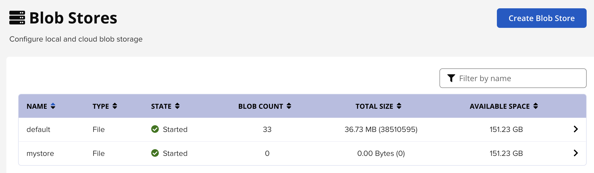

# Chapter6
This module we looked at Blob Storage

# Name: Blob Storage

# Description: 

Blob Store - Introduction

Nexus must have some kind of Storage to store all the uploaded files

Nexus is using Blob Stores 

Storage of binary files

Can exist on Local Storage or Cloud Storage

Blob Stores can be created per repository or combined

    root@ubuntu-s-4vcpu-8gb-nyc1-01:/opt/sonatype-work/nexus3# ls
    blobs  cache  db  elasticsearch  etc  generated-bundles  instances  kar  karaf.pid  keystores  lock  log  orient  port  restore-from-backup  tmp 

    root@ubuntu-s-4vcpu-8gb-nyc1-01:/opt/sonatype-work/nexus3# cd blobs/
    root@ubuntu-s-4vcpu-8gb-nyc1-01:/opt/sonatype-work/nexus3/blobs# ls
    default

Name        Type        State       BLOB Count      Total Size      Available Space
    
Type field = Storage Backend

    File - represents file system-based storage (default)

    S3 - cloud-based storage 

State field = state of the blob store

    started - indicates it's running as expected

    failed - indicates a configuration issue - failed to initialize

BLOB Count = number of Blobs that are currently stored. Split up into volumes

    root@ubuntu-s-4vcpu-8gb-nyc1-01:/opt/sonatype-work/nexus3/blobs/default/content# ls
    tmp     vol-03  vol-07  vol-09  vol-12  vol-16  vol-18  vol-21  vol-24  vol-28  vol-32  vol-34  vol-40
    vol-02  vol-05  vol-08  vol-11  vol-15  vol-17  vol-20  vol-23  vol-27  vol-31  vol-33  vol-37  vol-42

Total Size = size of all the combined blobs

Available Space = overall space allocated to a blob store

Creating a Blob Store from the UI

    Click Create Blob Store

        Options:

            File

            S3

    Name = name of new blob store

    Path = an absolute path to the desired file system location

        must be fully accessible by the OS user account (Nexus User)

        /opt/sonatype-work/nexus3/blobs/mystore

Blob Store - Things to consider

    Blob store can't be modified

    Any Blob Store used by a repository can't be deleted

Need to decide

    How many blob stores you create

    The size of each blob store

    Which will be used for which repository

    Approximately how much space each repository will need

        E.g. how may jar files, the size of each and frequency

        Clean-up policy - how many will you have maximum and minimum

Repositories can't use multiple Blob stores

Create Blob Store

    

    Available Space is allocated for the new Blob Store - 151.24 GB

    root@ubuntu-s-4vcpu-8gb-nyc1-01:/opt/sonatype-work/nexus3/blobs/default/content#  cd ../..; ls
    default  mystore

    The new blob store is created but is currently empty

Way to assign Blob store

    Create Repository

        Use Case: Docker Hosted

        Storage Section

            Blob Store: in the drop-down select from available blob stores - default, mystore

    Existing Repositories are using the Default Blob Store

        Click on Repository

        Select Maven Snapshots

        Scroll to Storage

            Blob Store = Default

        Note: Once allocated it can not be changed, it's permanent

# Usage

    